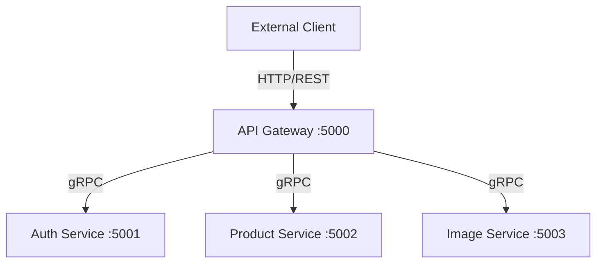

# gRPC Integration Guide

This document explains how gRPC is integrated into this project and provides instructions for adding new services, endpoints, and microservices.

## Architecture Overview

The project follows a microservice architecture where the **API Gateway** communicates with backend **Microservices** using gRPC for high-performance, internal communication.



## 1. Core Integration Components

### Shared Protobuf Definitions
All gRPC contracts (`.proto` files) are centralized in the `services/Shared.Protos` project. This ensures consistency and simplifies code generation across all services.

- **Location**: `services/Shared.Protos/Protos/`
- **Project Configuration**: The `Shared.Protos.csproj` uses `Grpc.Tools` to generate both **Client** and **Server** code:
  ```xml
  <ItemGroup>
    <Protobuf Include="Protos\common.proto" GrpcServices="Both" />
    <Protobuf Include="Protos\auth.proto" GrpcServices="Both" />
    <Protobuf Include="Protos\product.proto" GrpcServices="Both" />
  </ItemGroup>
  ```

### Service-Side Configuration (Server)
Each microservice that provides gRPC endpoints must:
1.  **Reference the Shared Project**: Add a project reference to `Shared.Protos`.
2.  **Enable gRPC Support**:
    ```csharp
    builder.Services.AddGrpc();
    ```
3.  **Map the Service Implementation**:
    ```csharp
    app.MapGrpcService<AuthGrpcService>();
    ```
4.  **Configure HTTP/2**: gRPC requires HTTP/2. Kestrel is configured in `Program.cs` to listen on specific ports with HTTP/1 and HTTP/2 support.

### Gateway-Side Configuration (Client)
The API Gateway consumes these services by:
1.  **Reference the Shared Project**: Add a project reference to `Shared.Protos`.
2.  **Register gRPC Clients**:
    ```csharp
    builder.Services.AddGrpcClient<AuthService.AuthServiceClient>(o => {
        o.Address = new Uri("http://localhost:5001");
    });
    ```
3.  **Dependency Injection**: Inject the client into controllers or handlers to make calls.

---

## 2. Adding a New Endpoint (to an existing service)

If you want to add a new method (e.g., `GetUserProfile`) to the `Auth` service:

1.  **Update `.proto`**: Modify `services/Shared.Protos/Protos/auth.proto`.
    ```protobuf
    service AuthService {
      rpc GetUserProfile (UserRequest) returns (UserResponse);
    }
    ```
2.  **Build**: Build the `Shared.Protos` project to regenerate the base classes.
3.  **Implement in Service**: Open the gRPC service implementation (e.g., `AuthGrpcService.cs`) in the `auth-service` project and override the new method.
    ```csharp
    public override async Task<UserResponse> GetUserProfile(UserRequest request, ServerCallContext context) {
        // Implementation logic
    }
    ```
4.  **Use in Gateway**: Inject the client into your Controller/Handler in the `gateway` project and call the new method.

---

## 3. Adding a New Microservice with gRPC

To create a brand-new microservice that uses gRPC:

1.  **Create Project**: Create a new ASP.NET Core Web API project in the `services/` folder.
2.  **Add Reference**: Reference `Shared.Protos.csproj`.
3.  **Configure Program.cs**:
    - Add `builder.Services.AddGrpc();`.
    - Configure Kestrel for HTTP/2 on a new port.
    - Map your new gRPC service class using `app.MapGrpcService<NewService>();`.
4.  **Implement Service**: Create a class that inherits from the generated base class (e.g., `NewService.NewServiceBase`).
5.  **Register in Gateway**: Update the `gateway/Program.cs` to register the new gRPC client pointing to the new service's port.

---

## 4. Best Practices

- **Centralized Contracts**: Always keep `.proto` files in the `Shared.Protos` project.
- **Port Management**: Ensure each microservice has a unique port for gRPC communication.
- **Error Handling**: Use gRPC-specific status codes (e.g., `StatusCode.NotFound`) instead of standard Exception handling where possible.
- **Async Everywhere**: Use `Task`-based async patterns for all gRPC methods to ensure scalability.

---

## 5. Background Tasks & Queues (Image Deletion)

Certain operations, such as bulk deleting images from MinIO or cleaning up files after a failed transaction rollback, can be time-consuming. Instead of blocking the gRPC or HTTP request, these operations are offloaded to an internal in-memory queue.

### How `ImageDeletionQueue` Works

The `Image-service` implements an asynchronous, thread-safe queue using `System.Threading.Channels`:

1. **The Queue (`ImageDeletionQueue`)**: An `IImageDeletionQueue` singleton is registered in `Image-service/Program.cs`. It utilizes a `BoundedChannel` to store `Guid` IDs of images marked for deletion.
2. **The Enqueue Operation**: When a deletion is triggered via the `[HttpDelete("bulk")]` API or the `BulkDeleteImage` gRPC method, the system instantly pushes the image IDs to the queue and responds immediately to the client with an accepted status.
3. **The Background Worker (`ImageDeletionBackgroundService`)**: A dedicated `BackgroundService` runs continuously in the background of the `Image-service`. It monitors the queue, pops IDs sequentially, instantiates a scoped `IMinioService`, and securely deletes the files from MinIO without slowing down frontend performance.

### Managing the Queue

- **Capacity**: The queue has a bounded limit defined in `ImageDeletionQueue.cs` (currently 1000 items). If the queue becomes full, `FullMode = BoundedChannelFullMode.Wait` ensures new requests wait asynchronously rather than dropping items.
- **Failures**: Errors during background deletion (like network failure with MinIO) are logged by the `ImageDeletionBackgroundService` via `ILogger`. You can monitor the Docker logs for `Error occurred while deleting image` to trace failures.
- **Modification**: This is an efficient in-memory queue suitable for single instances. If you scale the `Image-service` to multiple instances and require guaranteed delivery, consider migrating this bounded channel architecture to a distributed message broker like **RabbitMQ** or **Redis**.
